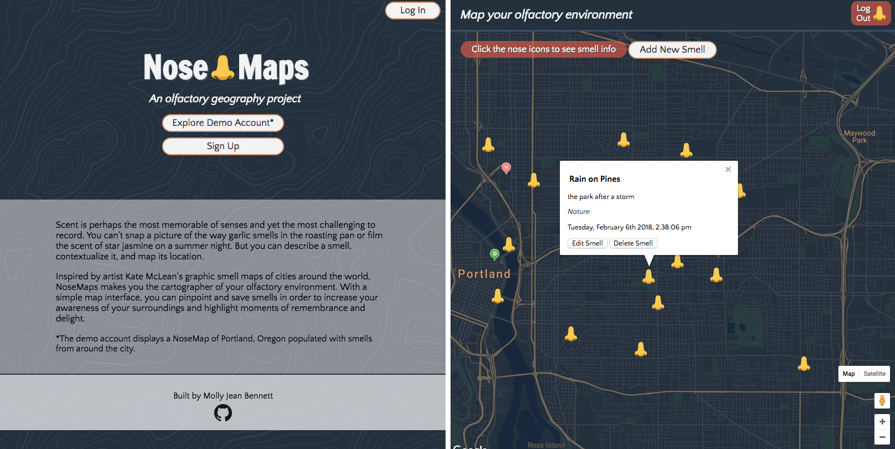

<h1>NoseMaps</h1>

<a href="https://nosemap.herokuapp.com/">NoseMaps</a> is a responsive full stack web app that lets users map their olfactory environment.

<h2>Introduction<h2>

Scent is perhaps the most memorable of senses and yet the most challenging to record. You can’t snap a picture of the way garlic smells in the roasting pan or film the scent of star jasmine on a summer night. But you can describe a smell, contextualize it, and map its location.

Inspired by <a href="http://sensorymaps.com/"> artist Kate McLean’s graphic smell maps</a> of cities around the world, NoseMaps is a tool that lets user pinpoint and save smells in their environment in order to increase sensory awareness and highlight moments of remembrance and delight.

<h2>Technology</h2>
<h3>Front End</h3>
<ul>
  <li>HTML5</li>
  <li>CSS3</li>
  <li>JavaScript</li>
  <li>jQuery</li>
</ul>
<h3>Back End</h3>
<ul>
  <li>Node.js + Express.js (web server)</li>
  <li>MongoDB (database)</li>
  <li><a href="https://mochajs.org/">Mocha</a> + <a href="http://chaijs.com/">Chai</a> (testing)</li>
  <li>Continuous integration and deployment with <a href="https://travis-ci.org/">Travis CI</a></li>
</ul>
<h3>Security</h3>
<ul>
<li><a href="https://jwt.io/">JSON Web Tokens</a> for authenticating users</li>
</ul>
<h2>Attribution</h2>
<ul>
<li><a href="http://www.heropatterns.com/">"Topography" background</a> by Steve Schoger</li>
<li>Map by <a href="https://developers.google.com/maps/documentation/javascript/ "Google Maps JavaScript API</a> </li>
</ul>
